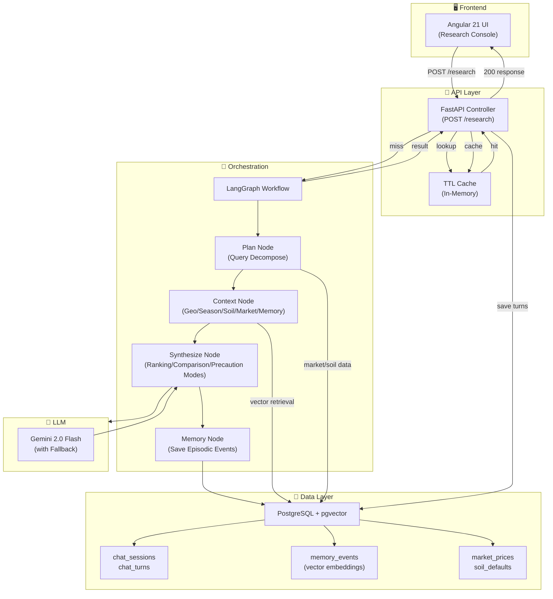
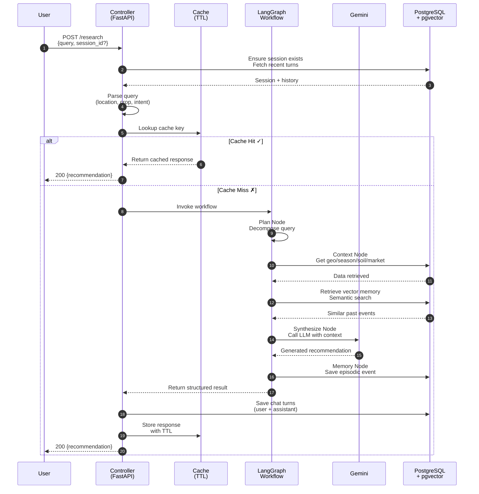
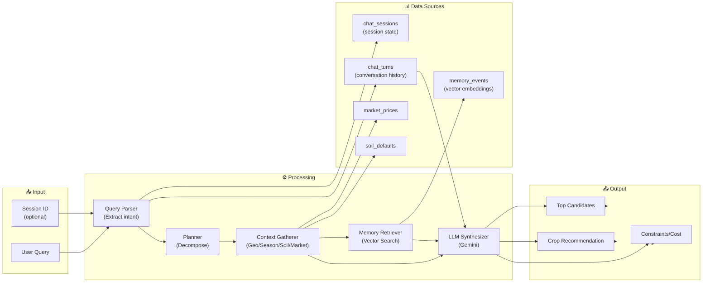
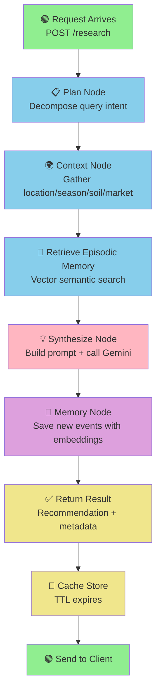

````markdown
# Detailed Architecture & Design Decisions

## 1) System overview

This project is a multi-turn agriculture research agent built for G3 (Deep Research Agent + Memory Constraints).

Core objectives:
- Answer complex crop-planning questions.
- Work under explicit memory/token and cost constraints.
- Keep conversation continuity across follow-up questions.

Primary stack:
- API layer: FastAPI
- Agent orchestration: LangGraph
- LLM synthesis: Gemini (with resilient fallback behavior)
- Persistence: PostgreSQL + pgvector
- Frontend: Angular 21 (standalone components + signals)
- Runtime: Docker Compose or local Conda environment

## 2) Runtime components

- API bootstrap: [DeepResearchAgent/app/main.py](DeepResearchAgent/app/main.py)
- Route composition: [DeepResearchAgent/app/controllers/router.py](DeepResearchAgent/app/controllers/router.py)
- Main research controller: [DeepResearchAgent/app/controllers/research_controller.py](DeepResearchAgent/app/controllers/research_controller.py)
- Workflow singleton: [DeepResearchAgent/app/core/workflow.py](DeepResearchAgent/app/core/workflow.py)
- LangGraph workflow: [DeepResearchAgent/app/graph.py](DeepResearchAgent/app/graph.py)
- Database init + seed logic: [DeepResearchAgent/app/db.py](DeepResearchAgent/app/db.py)
- Config and constraints: [DeepResearchAgent/app/config.py](DeepResearchAgent/app/config.py)

## 3) System Architecture Diagram



## 4) Request Flow (Step-by-Step)

1. **Client Request** → `POST /research` with query + optional session_id
2. **Session Resolution** → Controller ensures session exists in `chat_sessions`
3. **Query Parsing** → Extract location, crop focus, compare intent from query text
4. **Cache Lookup** → Check in-memory TTL cache with multi-dimensional key
   - **Cache HIT** → Return cached response immediately
   - **Cache MISS** → Proceed to workflow
5. **LangGraph Execution**:
   - **Plan Node** → Decompose query into actionable parts
   - **Context Node** → Gather location/season/soil/market data + retrieve semantic memory
   - **Synthesize Node** → Call Gemini LLM with appropriate mode (ranking/comparison/precaution)
   - **Memory Node** → Save new episodic events with vector embeddings
6. **Persist Conversation** → Save user + assistant turns in `chat_turns` table
7. **Cache Store** → Store response in TTL cache
8. **Return Response** → 200 response with recommendation + metadata

## 5) Request Sequence Diagram



## 6) Data Flow Diagram



## 7) LangGraph Node Execution Flow



## 4) LangGraph node design

### `plan`
- File: [DeepResearchAgent/app/graph.py](DeepResearchAgent/app/graph.py)
- Uses deterministic decomposition from [DeepResearchAgent/app/services/planner.py](DeepResearchAgent/app/services/planner.py).

### `context`
- Resolves geography: [DeepResearchAgent/app/services/geo.py](DeepResearchAgent/app/services/geo.py)
- Derives season: [DeepResearchAgent/app/services/season.py](DeepResearchAgent/app/services/season.py)
- Resolves soil: [DeepResearchAgent/app/services/soil.py](DeepResearchAgent/app/services/soil.py)
- Loads market trend snapshot: [DeepResearchAgent/app/services/market.py](DeepResearchAgent/app/services/market.py)
- Retrieves memory under token budget: [DeepResearchAgent/app/services/memory.py](DeepResearchAgent/app/services/memory.py)

### `synthesize`
- Builds structured prompt with conversation + retrieved memory context.
- Handles three modes:
  - generic ranking mode,
  - comparison mode for crop-vs-crop profitability,
  - focus-crop precaution mode for follow-up care/risk questions.
- Calls Gemini through [DeepResearchAgent/app/services/llm.py](DeepResearchAgent/app/services/llm.py).
- Emits recommendation, follow-up suggestions, constraints flags, and top candidates.

### `memory`
- Saves episodic memory events (`query` + `result`) for semantic retrieval later.

## 5) Memory architecture

### A) Semantic episodic memory (`memory_events`)
- Embedding: deterministic hash embedding for portable demo behavior.
- Storage: pgvector vector column.
- Retrieval: nearest neighbors, then token-budget clipping.

### B) Conversation memory (`chat_sessions`, `chat_turns`)
- Purpose: multi-turn continuity.
- Keeps prior location/crop focus/top candidates and complete turn transcript.
- Enables follow-up questions without re-supplying context.

## 6) Constraints strategy

Configured in [DeepResearchAgent/app/config.py](DeepResearchAgent/app/config.py) and `.env`:
- `MAX_CONTEXT_TOKENS` (default 2000)
- `MAX_SESSION_COST_USD` (default 0.05)
- `CACHE_ENABLED` and `CACHE_TTL_SECONDS`

Enforcement:
- Retrieval budget uses a capped token budget segment.
- Prompt/cost estimates are reported in response.
- `constraints_ok` indicates whether constraints were satisfied.

## 7) Caching strategy

- In-memory TTL cache implemented in [DeepResearchAgent/app/core/cache.py](DeepResearchAgent/app/core/cache.py).
- Integrated at controller level in [DeepResearchAgent/app/controllers/research_controller.py](DeepResearchAgent/app/controllers/research_controller.py).
- Cache key includes session/query/location/crop/IP dimensions for safe reuse.

## 8) API surface

Primary endpoints:
- `POST /research`
- `GET /sessions`
- `GET /sessions/{session_id}/history`
- `GET /health`

## 9) Data model summary

Reference data:
- [DeepResearchAgent/data/soil_defaults.json](DeepResearchAgent/data/soil_defaults.json)
- [DeepResearchAgent/data/crop_prices.csv](DeepResearchAgent/data/crop_prices.csv)

DB tables:
- `market_prices`
- `soil_defaults`
- `memory_events`
- `chat_sessions`
- `chat_turns`

## 10) Key design decisions

1. LangGraph over visual orchestrators
- Reason: deterministic, testable node-level behavior and explicit state transitions.

2. PostgreSQL + pgvector
- Reason: one DB for both relational state and vector retrieval, operational simplicity.

3. Two-layer memory
- Reason: semantic memory for long-term relevance + session turns for dialogue continuity.

4. Mode-aware synthesis
- Reason: avoid generic responses for specialized intents (comparison, precautions).

5. Graceful LLM fallback
- Reason: avoid hard failures when model identifiers or API behavior changes.

## 11) Known limitations

- Prototype agronomy logic is intentionally simplified.
- Price dataset is seed/mock and limited in geographic granularity.
- Cost estimation is heuristic, not exact provider billing.
- In-memory cache is single-process (not distributed).

## 12) Suggested future improvements

- Redis cache backend for multi-instance deployments.
- Rich agronomic data sources (district-level weather/soil APIs).
- Profitability model including input-cost datasets.
- Automated eval suite for response quality and constraint adherence.

## 13) Frontend architecture (Angular)

Frontend lives in sibling project folder `DeepResearchAgentUI`.

Routing and shell:
- Root shell: [DeepResearchAgentUI/src/app/app.ts](DeepResearchAgentUI/src/app/app.ts), [DeepResearchAgentUI/src/app/app.html](DeepResearchAgentUI/src/app/app.html), [DeepResearchAgentUI/src/app/app.css](DeepResearchAgentUI/src/app/app.css)
- Routes: [DeepResearchAgentUI/src/app/app.routes.ts](DeepResearchAgentUI/src/app/app.routes.ts)
   - `/` → Home page (`pages/home`)
   - `/research` → Research console (`pages/research`)

State management:
- `ResearchPage` uses Angular `signal()` for UI state:
   - query, location, soil, loading flags, API status,
   - chat messages, selected session, sessions list.

Service layer:
- API client: [DeepResearchAgentUI/src/app/services/research-api.service.ts](DeepResearchAgentUI/src/app/services/research-api.service.ts)
- Calls backend endpoints:
   - `GET /health`
   - `POST /research`
   - `GET /sessions`
   - `GET /sessions/{session_id}/history`

Interface contracts:
- Request/response interfaces are separated under:
   - [DeepResearchAgentUI/src/app/interfaces/health.interfaces.ts](DeepResearchAgentUI/src/app/interfaces/health.interfaces.ts)
   - [DeepResearchAgentUI/src/app/interfaces/research.interfaces.ts](DeepResearchAgentUI/src/app/interfaces/research.interfaces.ts)
   - [DeepResearchAgentUI/src/app/interfaces/session.interfaces.ts](DeepResearchAgentUI/src/app/interfaces/session.interfaces.ts)

UI behavior notes:
- Left panel scroll is constrained to session list only.
- Session cards use meaningful labels derived from history (not raw IDs).
- Assistant output renders markdown-style bold (`**text**`) for readability.

````
